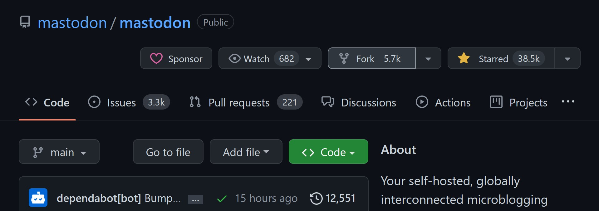
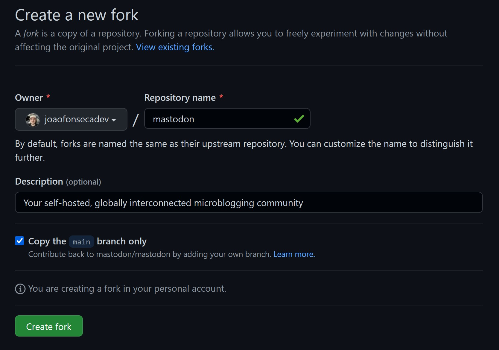
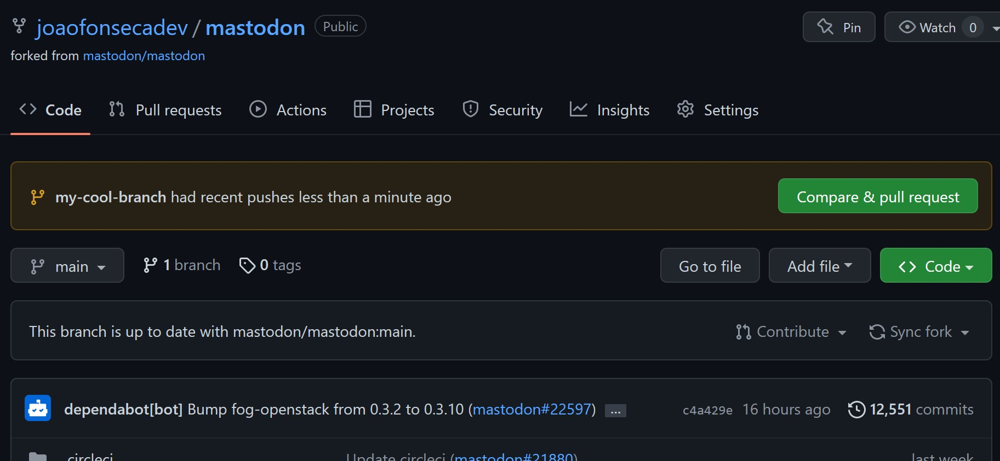
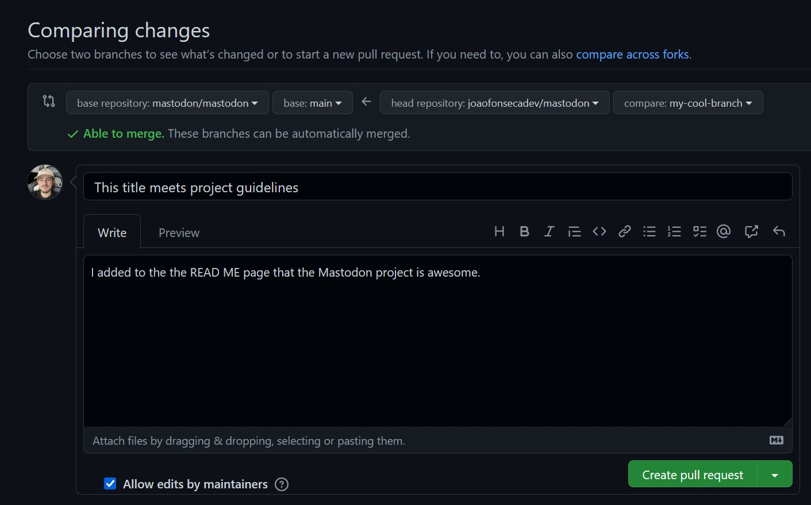

Recently I started getting into open-source projects, my most recent interest being with [Mastodon](https://github.com/mastodon/mastodon). Since the entire point of this blog is sharing information, I thought that teaching people how to contribute to open-source projects is a great topic for my first technical post.

For this guide, I'll assume that you have some familiarity with git. At least that you're comfortable enough to type some basic git commands in your terminal of choice.
First things first, you need to fork the desired repo. In this case, I'll use Mastodon's repo as an example.



After pressing the ```Fork``` button, you'll be redirected to the ```Create a new fork``` page. For our use case, it's completely fine to leave the default settings as they are. Whenever you're ready, press the ```Create fork``` button.



You should be redirected to your newly created repo. From here on out most of the process can be done in your terminal of choice. Let's start by cloning the repo. I'll clone the repo from ```git@github.com:joaofonsecadev/mastodon.git```, but if you don't have an SSH key configured in your Github account, you can use the HTTPS version ```https://github.com/joaofonsecadev/mastodon.git```. Do adjust the clone URL to match your repo.

```shell-session
$ git clone git@github.com:joaofonsecadev/mastodon.git
Cloning into 'mastodon'...
```

Now that you've cloned the repo you can ```cd``` into it and create a branch. Since this will be a branch in your repo, you can name it whatever you like but I advise keeping to project guidelines if there are any. For this example, I'll call it _my-cool-branch_.

```shell-session
$ cd mastodon
$ git checkout -b my-cool-branch
```

Let's start doing normal development in the new branch. You can commit to it as much as you want since it's your branch and in the end, it won't impact the destination repo. In my case, I simply decided to edit the ```README.md``` page.

```shell-session
$ git add .
$ git commit -m "My cool commit message"
$ git push -u origin my-cool-branch
```
> Tip: You only need to specify the ```git push``` command with ```-u origin YOUR_BRANCH_NAME``` the first time you push to it. From there on out you can simply use ```git push```.

After pushing the changes to the remote branch on Github, you can go back to your repo on the website where you should be greeted with a message saying ```my-cool-branch had recent pushes less than a minute ago``` and a ```Compare & pull request``` button.



By pressing the ```Compare & pull request``` button, you'll be redirected to a page where you'll be able to compare the changes from your branch with the original project's repository. Here you'll be able to write a title for your pull request, along with a description of what you did. Here you really should follow project guidelines if there are any, which any solid project should have. Whenever you're ready, click the ```Create pull request``` button.



And that's it! You've officially created a pull request on your project of choice. The process to get it approved and merged into the main branch varies a lot from project to project so, as I said previously, follow the project guidelines to learn about the whole process for the specific project you're contributing to. 

Happy coding!
